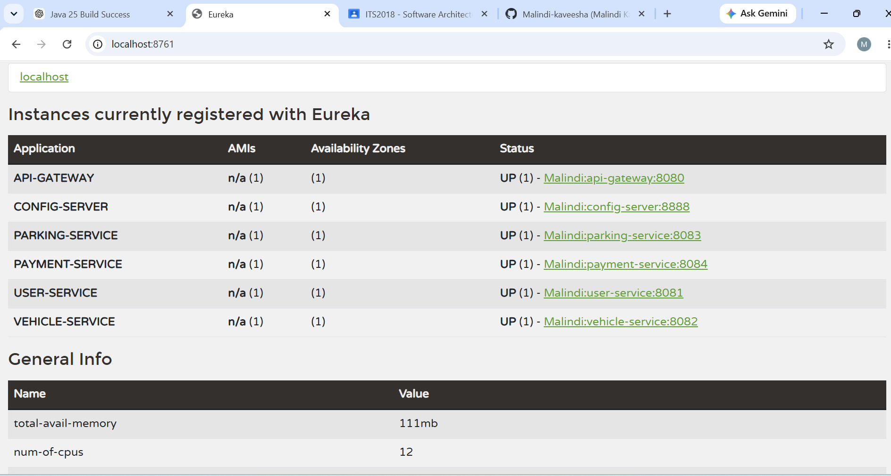

# Smart Parking Management System (SPMS) - Microservices with Azure AD

A comprehensive microservices-based Smart Parking Management System built with Spring Boot and Spring Cloud, integrated with Azure Active Directory (AAD) for authentication and authorization.

## Project Overview

This project demonstrates a distributed microservices architecture with the following key components:

- **API Gateway**: Central entry point for all client requests with routing and load balancing
- **Eureka Server**: Service discovery and registry for dynamic service registration
- **Config Server**: Centralized configuration management for all microservices
- **User Service**: Manages user accounts and profiles
- **Vehicle Service**: Handles vehicle registration and management
- **Parking Service**: Manages parking spot availability and reservations
- **Payment Service**: Processes payments for parking services

## Technology Stack

- **Java 21**: Latest Java LTS version
- **Spring Boot 4.1.0**: Modern application framework
- **Spring Cloud 2025.1.2**: Distributed systems framework
- **Spring Cloud Netflix Eureka**: Service discovery
- **Spring Cloud Config**: Configuration management
- **H2 Database**: In-memory database for development
- **Maven**: Build and dependency management

## Architecture

### Microservices

| Service | Port | Purpose |
|---------|------|---------|
| Eureka Server | 8761 | Service Discovery & Registry |
| Config Server | 8888 | Centralized Configuration |
| API Gateway | 8080 | Request Routing & Load Balancing |
| User Service | 8081 | User Management |
| Vehicle Service | 8082 | Vehicle Management |
| Parking Service | 8083 | Parking Operations |
| Payment Service | 8084 | Payment Processing |

## Getting Started

### Prerequisites

- Java 21 or later
- Maven 3.6 or later
- Git

### Building the Project

```bash
# Clean and build all services, skipping tests
./start_services.ps1
```

Each service includes a `pom.xml` with Maven Wrapper (mvnw) for cross-platform compatibility.

### Starting Services

Run the services in the following order:

1. **Eureka Server** (port 8761)
   ```bash
   cd eureka-server
   .\mvnw.cmd spring-boot:run
   ```

2. **Config Server** (port 8888)
   ```bash
   cd config-server
   .\mvnw.cmd spring-boot:run
   ```

3. **API Gateway** (port 8080)
   ```bash
   cd api-gateway
   .\mvnw.cmd spring-boot:run
   ```

4. **Other Microservices** (ports 8081-8084)
   ```bash
   cd [service-name]
   .\mvnw.cmd spring-boot:run
   ```

### Stopping Services

```bash
./stop_services.ps1
```

## Configuration

Configuration files for each service are located in the `config-repo/` directory:

- `application.yml`: Global application settings
- `api-gateway.yml`: API Gateway configuration
- `config-server.yml`: Config Server settings
- `eureka-server.yml`: Eureka Server configuration
- `user-service.yml`: User Service configuration
- `vehicle-service.yml`: Vehicle Service configuration
- `parking-service.yml`: Parking Service configuration
- `payment-service.yml`: Payment Service configuration

## API Documentation & Testing

### Postman Collection

Complete API endpoints and request examples are available in the Postman collection:

[Postman Collection](./postman_collection.json)

Import this collection into Postman to test all microservice endpoints with pre-configured requests.

## Service Registry & Discovery

### Eureka Dashboard

Monitor all registered services and their status:




Access the dashboard at: `http://localhost:8761/`

## Project Structure

```
Micro Service AAD 2/
├── api-gateway/              # API Gateway service
├── config-server/            # Configuration server
├── eureka-server/            # Service discovery server
├── parking-service/          # Parking management service
├── payment-service/          # Payment processing service
├── user-service/             # User management service
├── vehicle-service/          # Vehicle management service
├── config-repo/              # Configuration files
├── docs/                     # Documentation
│   └── screenshots/          # Screenshots (Eureka dashboard, etc.)
├── logs/                     # Service logs
├── README.md                 # This file
├── postman_collection.json   # API testing collection
├── start_services.ps1        # Script to build and start services
└── stop_services.ps1         # Script to stop services
```

## Key Features

✅ **Service Discovery**: Automatic service registration and discovery using Eureka  
✅ **Centralized Configuration**: Dynamic configuration management with Spring Cloud Config  
✅ **API Gateway Pattern**: Single entry point with intelligent routing  
✅ **Microservices Architecture**: Loosely coupled, independently deployable services  
✅ **Database per Service**: H2 in-memory databases for data isolation  
✅ **RESTful APIs**: Standard HTTP/JSON communication between services  
✅ **Cloud-Ready**: Designed for Azure deployment with Azure AD integration  

## Build & Deployment

### Clean Build
```bash
cd [service-directory]
.\mvnw.cmd clean package -DskipTests
```

### Run Tests
```bash
cd [service-directory]
.\mvnw.cmd test
```

### View Service Logs
Check the `logs/` directory for service startup and runtime logs:
- `[service-name].log.err`: Runtime logs
- `[service-name].startup.err`: Startup logs
- `[service-name].final.log.err`: Final logs

## Troubleshooting

### Services Not Registering
- Ensure Eureka Server is running first
- Check that services have the `spring-cloud-starter-netflix-eureka-client` dependency

### Configuration Not Loading
- Verify Config Server is running before other services
- Check `config-repo/` for configuration files
- Review logs in the `logs/` directory

### Port Conflicts
- Ensure ports 8761, 8888, 8080, 8081-8084 are available
- Modify configuration in `config-repo/` if needed

## Future Enhancements

- Azure AD integration for authentication and authorization
- API rate limiting and circuit breaker patterns
- Distributed tracing with Spring Cloud Sleuth
- Containerization with Docker and Kubernetes
- API versioning and documentation with Swagger/OpenAPI
- Event-driven architecture with message queues

## License

This project is provided as-is for educational purposes.

## Contributors

Created as part of Azure and Microservices learning initiative.

---

**Last Updated**: 2026-08-15  
**Java Version**: 21  
**Spring Boot Version**: 4.1.0  
**Spring Cloud Version**: 2025.1.2
